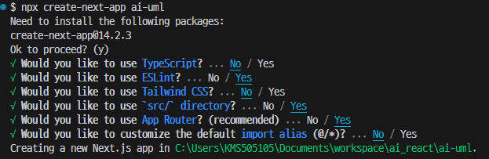

# openAI 의 API 를 활용한 React 프로젝트

## git repository 문제 해결

- `root(AI-REACT)` 폴더를 local git repository 로 등록하지 않은 상태에서 `create-next-app` 또는 `create-react-app` 명령으로 프로젝트를 생성하면, 개별 프로젝트가 local git repository 로 생성되어 버린다.

- 이 상태에서 `root` 폴더에서 `git init` 를 실행하고, local git repository 로 생성하는 경우 새로 만들어진 프로젝트 폴더가 `github.com` 에 정상적으로 업로드 되지 않는다.
- 이 때 먼저 새로 생성된 프로젝트 폴더에서 터미널을 열고 `rm -rf .git` 명령을 실행한다.
- 새로 생성된 프로젝트 폴더를 다른 이름으로 변경한다.
- 그리고 `root` 에서 다시 gitjub 에 add, push 를 실행하면 정상적으로 프로젝트 폴더가 업로드된다
